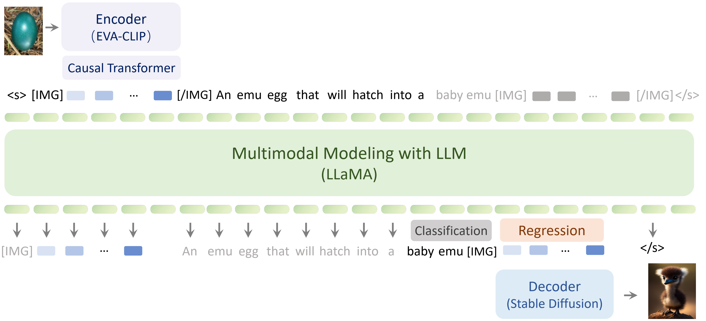
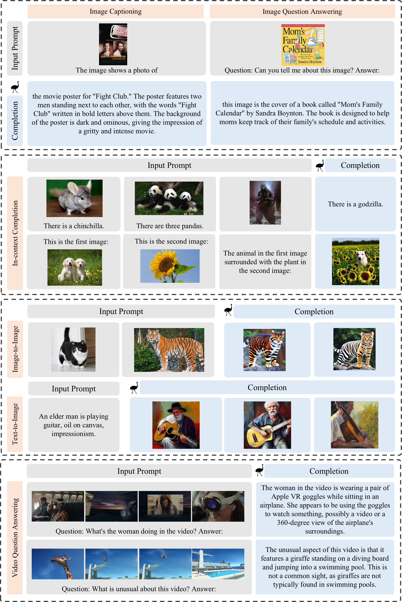

<div align='center'>
<h1>Emu: An Open Multimodal Generalist</h1h1>
<h3><a href="https://arxiv.org/abs/2307.05222">Generative Pretraining in Multimodality</a></h3>

[Quan Sun](https://github.com/Quan-Sun)<sup>1*</sup>, [Qiying Yu](https://yqy2001.github.io)<sup>2,1*</sup>, [Yufeng Cui]()<sup>1*</sup>, [Fan Zhang](https://scholar.google.com/citations?user=VsJ39HMAAAAJ)<sup>1*</sup>, [Xiaosong Zhang](https://github.com/zhangxiaosong18)<sup>1*</sup>, [Yueze Wang]()<sup>1</sup>, [Hongcheng Gao](https://hongcheng-gao.github.io/)<sup>1</sup>,<br>[Jingjing Liu](https://air.tsinghua.edu.cn/en/info/1046/1194.htm)<sup>2</sup>, [Tiejun Huang](https://scholar.google.com/citations?user=knvEK4AAAAAJ&hl=en)<sup>1,3</sup>, [Xinlong Wang](https://www.xloong.wang/)<sup>1</sup>
	
<sup>1</sup> [BAAI](https://www.baai.ac.cn/english.html), <sup>2</sup> [THU](https://air.tsinghua.edu.cn), <sup>3</sup> [PKU](https://english.pku.edu.cn/) <br><sup>*</sup> Equal Contribution

|  [Paper](https://arxiv.org/abs/2307.05222) | [Demo](https://emu.ssi.plus/) |
</div>


**Emu is a multimodal generalist that can seamlessly generate images and texts in multimodal context**. **Emu** is trained with a unified autoregressive objective, *i.e.*, predict-the-next-element, including both visual embeddings and textual tokens. Trained under this objective, **Emu** can serve as a generalist interface for both image-to-text and text-to-image tasks.



## Generalist Interface

**Emu** serves as a generalist interface capable of diverse multimodal tasks, such as image captioning, image/video question answering, and text-to-image generation, together with new abilities like in-context text and image generation, and image blending:



## Setup

Clone this repository and install required packages:

```shell
git clone https://github.com/baaivision/Emu
cd Emu

pip install -r requirements.txt
```

## Model Weights

We release the pretrained and instruction-tuned weights of **Emu**. Our weights are subject to LLaMA-1's [license](https://github.com/facebookresearch/llama/blob/1076b9c51c77ad06e9d7ba8a4c6df775741732bd/LICENSE).

| Model name         | Weight                                                  |
| ------------------ | ------------------------------------------------------- |
| **Emu w/ Decoder** | [🤗 HF link](https://huggingface.co/BAAI/Emu/tree/main/pretrain) (34GB) |
| **Emu-I**          | [🤗 HF link](https://huggingface.co/BAAI/Emu/blob/main/Emu-instruct.pt) (27GB) |

## Inference

At present, we provide inference code that can process interleaved image-text and **video** as input, and output text and image.

For instruction-tuned model, we provide examples for image captioning, visual question answering, and interleaved multi-image understanding:

```sh
python inference.py --instruct --ckpt-path ckpts/Emu-instruct.pt
```

For pretrained model, we provide an example for in-context learning:

```sh
python inference.py --ckpt-path ${PRETRAIN_CKPT_DIR}/multimodal_encoder/pytorch_model.bin
```

For image generation, we provide examples for image blending, text-to-image and in-context generation:

```sh
python image_inference.py --ckpt-path ${PRETRAIN_CKPT_DIR}
```

## Schedule

We are committed to open-sourcing all Emu related materials, including:

- [x] The weights of **Emu** and **Emu-I**
- [x] Inference example for interleaved image-text as input, text as output
- [x] Video inference example
- [x] Weights of image decoder & image generation/blending example
- [ ] YT-Storyboard-1B pretraining data
- [ ] Pretraining code
- [ ] Instruction tuning code
- [ ] Evaluation code

We hope to foster the growth of our community through open-sourcing and promoting collaboration👬. Let's step towards multimodal intelligence together🍻.

## Acknowledgement

We thank the great work from [LLaMA](https://github.com/facebookresearch/llama), [BLIP-2](https://github.com/salesforce/LAVIS), [Stable Diffusion](https://github.com/CompVis/stable-diffusion), and [FastChat](https://github.com/lm-sys/FastChat).

## Citation

If you find Emu useful for your research and applications, please consider starring this repository and citing:

```
@article{Emu,
  title={Generative Pretraining in Multimodality},
  author={Sun, Quan and Yu, Qiying and Cui, Yufeng and Zhang, Fan and Zhang, Xiaosong and Wang, Yueze and Gao, Hongcheng and Liu, Jingjing and Huang, Tiejun and Wang, Xinlong},
  publisher={arXiv preprint arXiv:2307.05222},
  year={2023},
}
```

## Misc

<div align="center">

[](https://github.com/baaivision/Emu/stargazers)


[](https://github.com/baaivision/Emu/network/members)


[](https://star-history.com/#baaivision/Emu&Date)

</div>


## FSDP Implement
- Model in **torch.float16**
- Inference takes about 31G in V100 >>>  Inference takes about 8G in 3090(WORLD_SIZE=8)
- Implement details
```
    Manually wraps submodules for FSDP and move other parameters to device_id.

    Why manually wrap?
    - all parameters within the FSDP wrapper must have the same requires_grad.
        We have a mix of frozen and unfrozen parameters.
    - model.vision_encoder.visual needs to be individually wrapped or encode_vision_x errors
        See: https://github.com/pytorch/pytorch/issues/82461#issuecomment-1269136344

    The rough wrapping structure is:
    - EMU(total about 24.8G in torch.float16)
        - visual (total about 1.8G in torch.float16)
        - ln_visual 
        - cformer
        - decoder (total about 24G in torch.float16) (about3.043G after FSDP of world_size 8)
            - lm
                - base_model
                    - model
                        - layers
                            - FSDP(nn.Module) * 40
                                - buffer(Not in parameters)
                                    - self_attn.rotary_emb.sin_cached
                                    - self_attn.rotary_emb.sin_cached
                        - FSDP(lm_head)
                        - FSDP(stu_regress_head)


    Known issues:
    - Our FSDP strategy is not compatible with tied embeddings. If the LM embeddings are tied,
        train with DDP or set the --freeze_lm_embeddings flag to true.
    - With FSDP + gradient ckpting, one can increase the batch size with seemingly no upper bound.
        Although the training curves look okay, we found that downstream performance dramatically
        degrades if the batch size is unreasonably large (e.g., 100 MMC4 batch size for OPT-125M).

    FAQs about our FSDP wrapping strategy:
    Why double wrap?
    As of torch==2.0.1, FSDP's _post_forward_hook and _post_backward_hook
    only free gathered parameters if the module is NOT FSDP root.

    Why unfreeze the decoder_layers?
    See https://github.com/pytorch/pytorch/issues/95805
    As of torch==2.0.1, FSDP's _post_backward_hook is only registed if the flat param
    requires_grad=True. We need the postback to fire to avoid OOM.
    To effectively freeze the decoder layers, we exclude them from the optimizer.

    What is assumed to be frozen v. unfrozen?
    We assume that the model is being trained under normal Flamingo settings
    with these lines being called in factory.py:
        ```
        # Freeze all parameters
        model.requires_grad_(False)
        assert sum(p.numel() for p in model.parameters() if p.requires_grad) == 0

        # Unfreeze perceiver, gated_cross_attn_layers, and LM input embeddings
        model.perceiver.requires_grad_(True)
        model.lang_encoder.gated_cross_attn_layers.requires_grad_(True)
        [optional] model.lang_encoder.get_input_embeddings().requires_grad_(True)
```